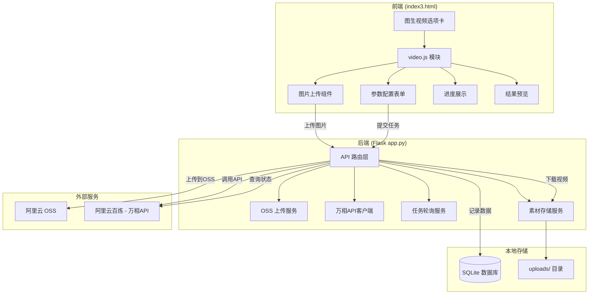

# 图生视频功能技术实现方案

> **项目**: HoloPix 素材调试器 - index3.html
> **功能**: 新增"图生视频"独立选项卡，支持首帧模式和首尾帧模式
> **对接API**: 阿里云百炼 - 万相图生视频 API (wan2.2-kf2v-flash)
> **素材中转**: 阿里云 OSS 存储
> **版本**: v1.0
> **日期**: 2026-04-05

---

## 一、需求概述

### 1.1 功能目标

在现有 `index3.html` 页面新增**图生视频**独立选项卡，支持以下两种生成模式：

| 模式 | 说明 | 输入 |
|------|------|------|
| **首帧模式** | 根据单张图片生成视频 | 首帧图片 + 提示词 |
| **首尾帧模式** | 根据首尾两张图片生成过渡视频 | 首帧图片 + 尾帧图片 + 提示词 |

### 1.2 业务流程

```
┌──────────────┐    ┌──────────────┐    ┌──────────────┐    ┌──────────────┐
│  选择/上传    │───→│  上传至OSS   │───→│  调用万相API │───→│  轮询任务状态 │
│  图片素材     │    │  获取公网URL │    │  提交异步任务 │    │  获取视频URL │
└──────────────┘    └──────────────┘    └──────────────┘    └──────┬──────┘
                                                                │
┌──────────────┐    ┌──────────────┐    ┌──────────────┐         │
│  存入本地    │←───│  下载视频    │←───│  视频生成完成 │←────────┘
│  素材库      │    │  到本地服务器 │    │              │
└──────────────┘    └──────────────┘    └──────────────┘
```

---

## 二、技术架构

### 2.1 整体架构图



### 2.2 技术栈

| 层级 | 技术 | 说明 |
|------|------|------|
| **前端** | 原生 JavaScript + CSS3 | 复用现有模块化架构 |
| **后端** | Flask (Python 3.8+) | 复用现有 Flask 应用 |
| **数据库** | SQLite | 新增 video_tasks 表 |
| **对象存储** | 阿里云 OSS Python SDK | 素材中转存储 |
| **AI API** | 阿里云百炼 - 万相 wan2.2-kf2v-flash | 图生视频生成 |

---

## 三、详细设计

### 3.1 数据库设计

#### 新增表: `video_tasks`（视频生成任务表）

```sql
CREATE TABLE IF NOT EXISTS video_tasks (
    id INTEGER PRIMARY KEY AUTOINCREMENT,
    task_id TEXT UNIQUE,                    -- 百炼返回的任务ID
    mode TEXT NOT NULL DEFAULT 'first_frame', -- 模式: first_frame / first_last_frame
    model TEXT DEFAULT 'wan2.2-kf2v-flash',  -- 使用的模型
    
    -- 输入参数
    prompt TEXT,                            -- 提示词
    first_frame_url TEXT,                   -- 首帧图片URL（OSS）
    first_frame_local TEXT,                 -- 首帧本地路径
    last_frame_url TEXT,                    -- 尾帧图片URL（OSS，可选）
    last_frame_local TEXT,                  -- 尾帧本地路径（可选）
    resolution TEXT DEFAULT '720P',         -- 分辨率: 480P/720P/1080P
    duration INTEGER DEFAULT 5,             -- 视频时长（秒），固定5秒
    prompt_extend BOOLEAN DEFAULT True,     -- 智能改写提示词
    watermark BOOLEAN DEFAULT True,         -- 添加水印
    
    -- 输出结果
    video_url TEXT,                         -- 生成的视频URL（百炼临时URL）
    video_local_path TEXT,                  -- 视频本地存储路径
    video_filename TEXT,                    -- 视频文件名
    
    -- 状态管理
    status TEXT DEFAULT 'pending',          -- pending/submitted/processing/succeeded/failed
    status_msg TEXT,                        -- 状态信息
    error_code TEXT,                        -- 错误码
    error_message TEXT,                     -- 错误信息
    
    -- 元数据
    request_body TEXT,                      -- 请求参数JSON
    response_body TEXT,                     -- 响应结果JSON
    created_at TIMESTAMP DEFAULT CURRENT_TIMESTAMP,
    updated_at TIMESTAMP DEFAULT CURRENT_TIMESTAMP
);
```

#### 扩展表: `assets`（素材表）

在现有 `assets` 表基础上，新增支持视频类型：

```sql
-- 已有字段可复用:
-- asset_type: 新增 'video' 类型
-- original_url: 存储百炼视频URL
-- local_path: 存储本地路径
-- filename: 存储文件名
```

### 3.2 后端 API 设计

#### 3.2.1 OSS 文件上传接口

```
POST /api/video/upload
Content-Type: multipart/form-data

Request:
  - file: 图片文件 (multipart)

Response:
{
  "success": true,
  "data": {
    "local_path": "/path/to/local/file.png",
    "oss_url": "https://bucket.oss-cn-beijing.aliyuncs.com/videos/xxx.png",
    "filename": "xxx.png"
  }
}
```

#### 3.2.2 提交图生视频任务接口

```
POST /api/video/generate
Content-Type: application/json

Request:
{
  "mode": "first_frame",                   // 或 "first_last_frame"
  "prompt": "Q版卡通角色缓慢旋转360度...",
  "first_frame_url": "https://oss.../first.png",
  "last_frame_url": "https://oss.../last.png",  // 可选
  "resolution": "720P",                    // 480P/720P/1080P
  "prompt_extend": true,
  "watermark": true
}

Response:
{
  "success": true,
  "data": {
    "task_id": "966cebcd-dedc-4962-af88-xxxxxx",
    "mode": "first_frame"
  },
  "msg": "任务提交成功"
}
```

#### 3.2.3 查询视频任务状态接口

```
GET /api/video/tasks/{task_id}

Response:
{
  "success": true,
  "data": {
    "task_id": "966cebcd-dedc-4962-af88-xxxxxx",
    "status": "SUCCEEDED",                 // PENDING/RUNNING/SUCCEEDED/FAILED
    "video_url": "https://dashscope-result-sh.oss-accelerate.aliyuncs.com/xxx.mp4",
    "mode": "first_frame",
    "prompt": "...",
    "created_at": "2026-04-05T10:00:00"
  }
}
```

#### 3.2.4 下载视频到本地接口

```
POST /api/video/tasks/{task_id}/download

Response:
{
  "success": true,
  "data": {
    "local_path": "/path/to/uploads/video_xxx.mp4",
    "filename": "video_xxx.mp4",
    "asset_id": 123
  },
  "msg": "视频已保存到素材库"
}
```

#### 3.2.5 获取视频任务列表接口

```
GET /api/video/tasks?limit=20&status=all

Response:
{
  "success": true,
  "data": [...],
  "count": 20
}
```

### 3.3 前端界面设计

#### 3.3.1 选项卡结构

在现有标签栏新增第6个选项卡：

```html
<!-- 在 .tabs 容器内添加 -->
<div class="tab" data-tab="video">🎬 图生视频</div>
```

#### 3.3.2 图生视频面板布局

```
┌─────────────────────────────────────────────────────────────┐
│ 🎬 图生视频                                                 │
├─────────────────────────────────────────────────────────────┤
│                                                             │
│ ┌─────────────────────────────────────────────────────────┐ │
│ │ 1️⃣ 选择模式                                              │ │
│ │  ○ 首帧模式（输入一张图片）  ● 首尾帧模式（输入两张图片）  │ │
│ └─────────────────────────────────────────────────────────┘ │
│                                                             │
│ ┌────────────────────────┬────────────────────────────────┐ │
│ │ 📷 首帧图片             │ 📷 尾帧图片（首尾帧模式显示）   │ │
│ │ ┌──────────────────┐   │ ┌──────────────────┐           │ │
│ │ │                  │   │ │                  │           │ │
│ │ │   拖拽或点击     │   │ │   拖拽或点击     │           │ │
│ │ │   上传图片       │   │ │   上传图片       │           │ │
│ │ │                  │   │ │                  │           │ │
│ │ └──────────────────┘   │ └──────────────────┘           │ │
│ │ [选择文件] [从素材库选] │ [选择文件] [从素材库选]         │ │
│ └────────────────────────┴────────────────────────────────┘ │
│                                                             │
│ ┌─────────────────────────────────────────────────────────┐ │
│ │ 2️⃣ 提示词配置                                           │ │
│ │ ┌─────────────────────────────────────────────────────┐ │ │
│ │ │ 描述视频内容和动作效果...                              │ │ │
│ │ │ (例如：Q版卡通角色缓慢旋转360度，纯色背景)            │ │ │
│ │ └─────────────────────────────────────────────────────┘ │ │
│ └─────────────────────────────────────────────────────────┘ │
│                                                             │
│ ┌─────────────────────────────────────────────────────────┐ │
│ │ 3️⃣ 高级设置                                             │ │
│ │ ┌─────────────┬─────────────┬─────────────────────────┐ │ │
│ │ │ 分辨率       │ 模型选择    │ □ 智能改写提示词        │ │ │
│ │ │ [720P▼]     │ [wan2.2..] │ ☑ 添加水印             │ │ │
│ │ └─────────────┴─────────────┴─────────────────────────┘ │ │
│ └─────────────────────────────────────────────────────────┘ │
│                                                             │
│            ┌──────────────────────────────┐                 │
│            │  🎬 生成视频                 │                 │
│            └──────────────────────────────┘                 │
│                                                             │
│ ┌─────────────────────────────────────────────────────────┐ │
│ │ ⏳ 生成进度（初始隐藏）                                   │ │
│ │ ████████████░░░░░░░░ 60%  正在生成中...  已等待: 45秒    │ │
│ └─────────────────────────────────────────────────────────┘ │
│                                                             │
│ ┌─────────────────────────────────────────────────────────┐ │
│ │ 🎉 生成结果（初始隐藏）                                  │ │
│ │ ┌──────────┐ ┌──────────┐ ┌──────────┐                │ │
│ │ │  视频1   │ │  视频2   │ │  视频3   │                │ │
│ │ │ [▶播放]  │ │ [▶播放]  │ │ [▶播放]  │                │ │
│ │ │ [下载]   │ │ [下载]   │ │ [下载]   │                │ │
│ │ └──────────┘ └──────────┘ └──────────┘                │ │
│ └─────────────────────────────────────────────────────────┘ │
│                                                             │
│ ┌─────────────────────────────────────────────────────────┐ │
│ │ 📜 视频生成历史                                          │ │
│ │ ...                                                      │ │
│ └─────────────────────────────────────────────────────────┘ │
└─────────────────────────────────────────────────────────────┘
```

### 3.4 核心模块设计

#### 3.4.1 后端模块: `oss_client.py`（OSS 客户端）

```python
# server/oss_client.py

import oss2
import os
import uuid
from datetime import datetime
from config import (
    OSS_ACCESS_KEY_ID,
    OSS_ACCESS_KEY_SECRET,
    OSS_BUCKET_NAME,
    OSS_ENDPOINT
)


class OSSClient:
    """阿里云 OSS 客户端"""
    
    def __init__(self):
        self.auth = oss2.Auth(OSS_ACCESS_KEY_ID, OSS_ACCESS_KEY_SECRET)
        self.bucket = oss2.Bucket(self.auth, OSS_ENDPOINT, OSS_BUCKET_NAME)
    
    def upload_file(self, local_path: str, object_key: str = None) -> dict:
        """
        上传文件到 OSS
        :param local_path: 本地文件路径
        :param object_key: OSS 对象键，不传则自动生成
        :return: {'oss_url': str, 'object_key': str}
        """
        if not object_key:
            ext = os.path.splitext(local_path)[1]
            timestamp = datetime.now().strftime('%Y%m%d/%H%M%S')
            random_id = uuid.uuid4().hex[:8]
            object_key = f'holopix-videos/{timestamp}_{random_id}{ext}'
        
        with open(local_path, 'rb') as f:
            result = self.bucket.put_object(object_key, f)
        
        if result.status == 200:
            oss_url = f'https://{OSS_BUCKET_NAME}.{OSS_ENDPOINT.replace("https://", "")}/{object_key}'
            return {
                'success': True,
                'oss_url': oss_url,
                'object_key': object_key
            }
        else:
            return {'success': False, 'error': f'Upload failed: {result.status}'}
    
    def upload_from_bytes(self, file_data: bytes, filename: str, object_key: str = None) -> dict:
        """
        从字节数据上传到 OSS
        :param file_data: 文件字节数据
        :param filename: 原始文件名
        :param object_key: OSS 对象键
        :return: {'oss_url': str, 'object_key': str}
        """
        if not object_key:
            ext = os.path.splitext(filename)[1]
            timestamp = datetime.now().strftime('%Y%m%d/%H%M%S')
            random_id = uuid.uuid4().hex[:8]
            object_key = f'holopix-videos/{timestamp}_{random_id}{ext}'
        
        result = self.bucket.put_object(object_key, file_data)
        
        if result.status == 200:
            oss_url = f'https://{OSS_BUCKET_NAME}.{OSS_ENDPOINT.replace("https://", "")}/{object_key}'
            return {
                'success': True,
                'oss_url': oss_url,
                'object_key': object_key
            }
        else:
            return {'success': False, 'error': f'Upload failed: {result.status}'}


# 全局实例
oss_client = OSSClient()
```

#### 3.4.2 后端模块: `dashscope_client.py`（百炼 API 客户端）

```python
# server/dashscope_client.py

import requests
import time
from typing import Optional, Dict
from config import DASHSCOPE_API_KEY, DASHSCOPE_BASE_URL


class DashScopeClient:
    """阿里云百炼 API 客户端 - 万相图生视频"""
    
    BASE_URL = DASHSCOPE_BASE_URL  # https://dashscope.aliyuncs.com/api/v1
    MODEL = "wan2.2-kf2v-flash"   # 推荐模型
    
    def __init__(self, api_key: str = None):
        self.api_key = api_key or DASHSCOPE_API_KEY
        self.headers = {
            "Content-Type": "application/json",
            "Authorization": f"Bearer {self.api_key}",
            "X-DashScope-Async": "enable"  # 必须启用异步
        }
    
    def submit_video_task(self, 
                          first_frame_url: str,
                          prompt: str = "",
                          last_frame_url: str = None,
                          mode: str = "first_frame",
                          resolution: str = "720P",
                          prompt_extend: bool = True,
                          watermark: bool = True) -> Dict:
        """
        提交图生视频任务
        
        :param first_frame_url: 首帧图片公网URL（必填）
        :param prompt: 提示词（推荐填写）
        :param last_frame_url: 尾帧图片URL（首尾帧模式必填）
        :param mode: 模式 'first_frame' 或 'first_last_frame'
        :param resolution: 分辨率 480P/720P/1080P
        :param prompt_extend: 是否智能改写提示词
        :param watermark: 是否添加水印
        :return: {'success': bool, 'task_id': str, ...}
        """
        # 构建输入
        input_data = {
            "first_frame_url": first_frame_url,
            "prompt": prompt
        }
        
        # 首尾帧模式需要尾帧
        if mode == "first_last_frame":
            if not last_frame_url:
                return {
                    'success': False,
                    'error': '首尾帧模式必须提供尾帧图片'
                }
            input_data["last_frame_url"] = last_frame_url
        
        # 构建请求体
        payload = {
            "model": self.MODEL,
            "input": input_data,
            "parameters": {
                "resolution": resolution,
                "prompt_extend": prompt_extend,
                "watermark": watermark
            }
        }
        
        try:
            response = requests.post(
                f"{self.BASE_URL}/services/aigc/image2video/video-synthesis",
                headers=self.headers,
                json=payload,
                timeout=30
            )
            
            result = response.json()
            
            if "output" in result and "task_id" in result["output"]:
                return {
                    'success': True,
                    'task_id': result["output"]["task_id"],
                    'request_id': result.get("request_id")
                }
            else:
                return {
                    'success': False,
                    'error': result.get("message", "未知错误"),
                    'code': result.get("code"),
                    'raw': result
                }
                
        except requests.exceptions.RequestException as e:
            return {'success': False, 'error': str(e)}
    
    def query_task_status(self, task_id: str) -> Dict:
        """
        查询视频任务状态
        
        :param task_id: 任务ID
        :return: {'success': bool, 'status': str, 'video_url': str, ...}
        """
        try:
            url = f"{self.BASE_URL}/tasks/{task_id}"
            headers = {"Authorization": f"Bearer {self.api_key}"}
            
            response = requests.get(url, headers=headers, timeout=30)
            result = response.json()
            
            output = result.get("output", {})
            status = output.get("task_status", "UNKNOWN")
            
            return {
                'success': True,
                'task_id': task_id,
                'status': status,          # PENDING/RUNNING/SUCCEEDED/FAILED
                'video_url': output.get("video_url"),
                'request_id': result.get("request_id"),
                'message': output.get("message", ""),
                'code': output.get("code"),
                'raw': result
            }
            
        except requests.exceptions.RequestException as e:
            return {'success': False, 'error': str(e)}
    
    def download_video(self, video_url: str, save_path: str) -> bool:
        """
        下载视频到本地
        :param video_url: 视频URL
        :param save_path: 本地保存路径
        :return: 是否成功
        """
        try:
            response = requests.get(video_url, stream=True, timeout=120)
            response.raise_for_status()
            
            with open(save_path, 'wb') as f:
                for chunk in response.iter_content(chunk_size=8192):
                    f.write(chunk)
            
            return True
        except Exception as e:
            print(f"[DashScope] 下载视频失败: {e}")
            return False


# 全局实例
dashscope_client = DashScopeClient()
```

#### 3.4.3 前端模块: `video.js`（图生视频模块）

```javascript
/**
 * 图生视频模块
 * 处理图生视频的完整流程：图片上传 → 参数配置 → 任务提交 → 结果展示
 */
const VideoGenerator = {
    // 当前模式: 'first_frame' | 'first_last_frame'
    currentMode: 'first_frame',
    
    // 当前选择的图片
    selectedImages: {
        firstFrame: null,  // { file, url, name, ossUrl }
        lastFrame: null
    },
    
    // 支持的分辨率选项
    resolutions: [
        { value: '480P', label: '480P (标清)' },
        { value: '720P', label: '720P (高清)' },
        { value: '1080P', label: '1080P (全高清)' }
    ],
    
    // 支持的模型列表
    models: [
        { value: 'wan2.2-kf2v-flash', label: '万相2.2 (推荐)' },
        { value: 'wanx2.1-kf2v-plus', label: '万相2.1 Plus' }
    ],
    
    init() {
        this.bindEvents();
        this.initDropZones();
        this.loadHistory();
    },
    
    bindEvents() {
        // 模式切换
        document.querySelectorAll('[data-video-mode]').forEach(radio => {
            radio.addEventListener('change', (e) => this.switchMode(e.target.value));
        });
        
        // 生成按钮
        const generateBtn = document.querySelector('[data-action="generateVideo"]');
        if (generateBtn) {
            generateBtn.addEventListener('click', () => this.generateVideo());
        }
        
        // 文件选择按钮
        document.querySelectorAll('[data-select-image]').forEach(btn => {
            btn.addEventListener('click', (e) => {
                const type = e.currentTarget.dataset.selectImage;
                this.selectImageFile(type);
            });
        });
        
        // 从素材库选择
        document.querySelectorAll('[data-select-from-assets]').forEach(btn => {
            btn.addEventListener('click', (e) => {
                const type = e.currentTarget.dataset.selectFromAssets;
                this.openAssetSelector(type);
            });
        });
    },
    
    switchMode(mode) {
        this.currentMode = mode;
        
        // 显示/隐藏尾帧区域
        const lastFrameSection = document.getElementById('lastFrameSection');
        if (lastFrameSection) {
            lastFrameSection.style.display = mode === 'first_last_frame' ? 'block' : 'none';
        }
        
        // 更新UI提示
        const modeHint = document.getElementById('modeHint');
        if (modeHint) {
            modeHint.textContent = mode === 'first_frame' 
                ? '当前模式：仅使用首帧图片生成视频'
                : '当前模式：使用首尾帧图片生成过渡动画';
        }
    },
    
    initDropZones() {
        // 初始化拖拽上传区域
        ['firstFrame', 'lastFrame'].forEach(type => {
            const dropZone = document.getElementById(`${type}DropZone`);
            if (!dropZone) return;
            
            ['dragenter', 'dragover'].forEach(eventName => {
                dropZone.addEventListener(eventName, (e) => {
                    e.preventDefault();
                    dropZone.classList.add('drag-over');
                });
            });
            
            ['dragleave', 'drop'].forEach(eventName => {
                dropZone.addEventListener(eventName, (e) => {
                    e.preventDefault();
                    dropZone.classList.remove('drag-over');
                });
            });
            
            dropZone.addEventListener('drop', (e) => {
                const files = e.dataTransfer.files;
                if (files.length > 0) {
                    this.handleImageSelect(files[0], type);
                }
            });
        });
    },
    
    selectImageFile(type) {
        const input = document.createElement('input');
        input.type = 'file';
        input.accept = 'image/*';
        input.onchange = (e) => {
            if (e.target.files.length > 0) {
                this.handleImageSelect(e.target.files[0], type);
            }
        };
        input.click();
    },
    
    async handleImageSelect(file, type) {
        // 验证文件类型
        if (!file.type.startsWith('image/')) {
            alert('请选择图片文件');
            return;
        }
        
        // 验证文件大小（最大10MB）
        if (file.size > 10 * 1024 * 1024) {
            alert('图片大小不能超过10MB');
            return;
        }
        
        // 显示预览
        this.previewImage(file, type);
        
        // 上传到服务器并获取OSS URL
        await this.uploadImage(file, type);
    },
    
    previewImage(file, type) {
        const preview = document.getElementById(`${type}Preview`);
        const placeholder = document.getElementById(`${type}Placeholder`);
        
        if (preview && placeholder) {
            const url = URL.createObjectURL(file);
            preview.src = url;
            preview.style.display = 'block';
            placeholder.style.display = 'none';
        }
        
        // 保存到状态
        this.selectedImages[type === 'firstFrame' ? 'firstFrame' : 'lastFrame'] = {
            file: file,
            url: URL.createObjectURL(file),
            name: file.name
        };
    },
    
    async uploadImage(file, type) {
        const statusEl = document.getElementById(`${type}UploadStatus`);
        if (statusEl) statusEl.textContent = '上传中...';
        
        try {
            const formData = new FormData();
            formData.append('file', file);
            
            const response = await fetch('/api/video/upload', {
                method: 'POST',
                body: formData
            });
            
            const result = await response.json();
            
            if (result.success) {
                // 保存OSS URL
                const imageKey = type === 'firstFrame' ? 'firstFrame' : 'lastFrame';
                this.selectedImages[imageKey].ossUrl = result.data.oss_url;
                this.selectedImages[imageKey].localPath = result.data.local_path;
                
                if (statusEl) statusEl.textContent = '✅ 上传成功';
            } else {
                if (statusEl) statusEl.textContent = '❌ 上传失败';
                alert('图片上传失败: ' + (result.error || '未知错误'));
            }
        } catch (error) {
            if (statusEl) statusEl.textContent = '❌ 上传失败';
            alert('上传出错: ' + error.message);
        }
    },
    
    collectFormData() {
        // 验证首帧图片
        if (!this.selectedImages.firstFrame || !this.selectedImages.firstFrame.ossUrl) {
            alert('请选择或上传首帧图片');
            return null;
        }
        
        // 验证尾帧图片（首尾帧模式）
        if (this.currentMode === 'first_last_frame') {
            if (!this.selectedImages.lastFrame || !this.selectedImages.lastFrame.ossUrl) {
                alert('请选择或上传尾帧图片');
                return null;
            }
        }
        
        return {
            mode: this.currentMode,
            prompt: document.getElementById('videoPrompt')?.value || '',
            first_frame_url: this.selectedImages.firstFrame.ossUrl,
            last_frame_url: this.selectedImages.lastFrame?.ossUrl || null,
            resolution: document.getElementById('videoResolution')?.value || '720P',
            model: document.getElementById('videoModel')?.value || 'wan2.2-kf2v-flash',
            prompt_extend: document.getElementById('promptExtend')?.checked ?? true,
            watermark: document.getElementById('watermark')?.checked ?? true
        };
    },
    
    async generateVideo() {
        const data = this.collectFormData();
        if (!data) return;
        
        try {
            // 显示进度
            this.showProgress();
            
            // 提交任务
            const response = await fetch('/api/video/generate', {
                method: 'POST',
                headers: { 'Content-Type': 'application/json' },
                body: JSON.stringify(data)
            });
            
            const result = await response.json();
            
            if (result.success) {
                // 启动轮询
                VideoPoller.startPolling(result.data.task_id, data);
                
                // 添加到历史
                this.addToHistory(result.data.task_id, data);
                
                alert('视频生成任务已提交！\n任务ID: ' + result.data.task_id);
            } else {
                this.hideProgress();
                alert('任务提交失败: ' + (result.error || result.msg || '未知错误'));
            }
        } catch (error) {
            this.hideProgress();
            alert('请求失败: ' + error.message);
        }
    },
    
    showProgress() {
        const el = document.getElementById('videoProgress');
        if (el) el.style.display = 'block';
        this.updateProgress(0, '正在提交任务...', 0);
    },
    
    hideProgress() {
        const el = document.getElementById('videoProgress');
        if (el) el.style.display = 'none';
    },
    
    updateProgress(progress, status, elapsedSeconds) {
        const fill = document.getElementById('videoProgressFill');
        const statusEl = document.getElementById('videoProgressStatus');
        const timeEl = document.getElementById('videoProgressTime');
        
        if (fill) fill.style.width = progress + '%';
        if (statusEl) statusEl.textContent = status;
        if (timeEl) timeEl.textContent = `已等待: ${elapsedSeconds}秒`;
    },
    
    addToHistory(taskId, params) {
        const history = JSON.parse(localStorage.getItem('video_generation_history') || '[]');
        history.unshift({
            taskId,
            params,
            timestamp: new Date().toISOString(),
            status: 'submitted'
        });
        if (history.length > 50) history.pop();
        localStorage.setItem('video_generation_history', JSON.stringify(history));
        this.renderHistory();
    },
    
    renderHistory() {
        const container = document.getElementById('videoHistoryList');
        if (!container) return;
        
        const history = JSON.parse(localStorage.getItem('video_generation_history') || '[]');
        
        if (history.length === 0) {
            container.innerHTML = '<p style="color: #999; padding: 20px; text-align: center;">暂无视频生成记录</p>';
            return;
        }
        
        container.innerHTML = history.map(item => `
            <div class="history-item" style="
                padding: 12px;
                border-bottom: 1px solid #eee;
                display: flex;
                justify-content: space-between;
                align-items: center;
            ">
                <div>
                    <div style="font-weight: 500; font-size: 13px;">${item.taskId.substring(0, 12)}...</div>
                    <div style="font-size: 11px; color: #999; margin-top: 2px;">
                        ${item.params.mode} | ${new Date(item.timestamp).toLocaleString('zh-CN')}
                    </div>
                </div>
                <span class="status-badge status-${item.status}">${item.statusText || item.status}</span>
            </div>
        `).join('');
    },
    
    loadHistory() {
        this.renderHistory();
    },
    
    openAssetSelector(type) {
        // TODO: 打开素材库选择器弹窗
        alert(`从素材库选择${type === 'firstFrame' ? '首帧' : '尾帧'}图片 - 功能开发中`);
    },
    
    resetForm() {
        this.selectedImages = { firstFrame: null, lastFrame: null };
        this.currentMode = 'first_frame';
        
        // 重置预览
        ['firstFrame', 'lastFrame'].forEach(type => {
            const preview = document.getElementById(`${type}Preview`);
            const placeholder = document.getElementById(`${type}Placeholder`);
            const status = document.getElementById(`${type}UploadStatus`);
            
            if (preview) {
                preview.src = '';
                preview.style.display = 'none';
            }
            if (placeholder) placeholder.style.display = 'flex';
            if (status) status.textContent = '';
        });
    }
};

/**
 * 视频任务轮询器
 */
const VideoPoller = {
    pollingIntervals: new Map(),
    maxAttempts: 240,   // 最大尝试次数 (约20分钟)
    interval: 5000,     // 轮询间隔 5秒
    
    startPolling(taskId, taskParams) {
        if (this.pollingIntervals.has(taskId)) {
            this.stopPolling(taskId);
        }
        
        let attempts = 0;
        const startTime = Date.now();
        
        this.queryTask(taskId, taskParams, attempts, startTime);
        
        const intervalId = setInterval(() => {
            attempts++;
            if (attempts >= this.maxAttempts) {
                this.handleTimeout(taskId);
                return;
            }
            this.queryTask(taskId, taskParams, attempts, startTime);
        }, this.interval);
        
        this.pollingIntervals.set(taskId, intervalId);
    },
    
    stopPolling(taskId) {
        const intervalId = this.pollingIntervals.get(taskId);
        if (intervalId) {
            clearInterval(intervalId);
            this.pollingIntervals.delete(taskId);
        }
    },
    
    async queryTask(taskId, taskParams, attempts, startTime) {
        try {
            const response = await fetch(`/api/video/tasks/${taskId}`);
            const result = await response.json();
            
            if (!result.success) {
                console.error('查询视频任务状态失败:', result.error);
                return;
            }
            
            const data = result.data;
            const elapsedTime = Math.floor((Date.now() - startTime) / 1000);
            
            this.updateProgressUI(data, elapsedTime);
            
            switch (data.status) {
                case 'SUCCEEDED':
                    this.handleSuccess(taskId, data, taskParams);
                    break;
                case 'FAILED':
                    this.handleFailure(taskId, data);
                    break;
                case 'PENDING':
                case 'RUNNING':
                    break;
            }
        } catch (error) {
            console.error('轮询出错:', error);
        }
    },
    
    updateProgressUI(data, elapsedTime) {
        let progress = 0;
        let statusText = '处理中...';
        
        switch (data.status) {
            case 'PENDING':
                progress = 10;
                statusText = '排队中，等待处理...';
                break;
            case 'RUNNING':
                progress = Math.min(10 + (elapsedTime / 10), 80);
                statusText = '正在生成视频...';
                break;
            case 'SUCCEEDED':
                progress = 100;
                statusText = '视频生成完成！';
                break;
            case 'FAILED':
                progress = 0;
                statusText = '生成失败';
                break;
        }
        
        if (typeof VideoGenerator !== 'undefined') {
            VideoGenerator.updateProgress(progress, statusText, elapsedTime);
        }
    },
    
    handleSuccess(taskId, data, taskParams) {
        this.stopPolling(taskId);
        
        if (typeof VideoGenerator !== 'undefined') {
            VideoGenerator.hideProgress();
        }
        
        // 显示结果
        this.displayResult(data);
        
        // 更新历史
        this.updateHistoryStatus(taskId, 'succeed', '已完成');
        
        // 自动下载到本地
        this.autoDownloadVideo(taskId);
        
        alert('🎉 视频生成成功！');
    },
    
    handleFailure(taskId, data) {
        this.stopPolling(taskId);
        
        if (typeof VideoGenerator !== 'undefined') {
            VideoGenerator.hideProgress();
        }
        
        this.updateHistoryStatus(taskId, 'failed', '失败');
        
        alert('❌ 视频生成失败: ' + (data.message || data.error_message || '未知错误'));
    },
    
    handleTimeout(taskId) {
        this.stopPolling(taskId);
        
        if (typeof VideoGenerator !== 'undefined') {
            VideoGenerator.hideProgress();
        }
        
        this.updateHistoryStatus(taskId, 'timeout', '超时');
        
        alert('⏰ 视频生成超时，请稍后在任务列表查看结果');
    },
    
    displayResult(data) {
        const container = document.getElementById('videoResults');
        if (!container) return;
        
        container.style.display = 'block';
        
        const videoCard = `
            <div class="video-result-card" style="
                background: white;
                border-radius: 12px;
                overflow: hidden;
                box-shadow: 0 4px 12px rgba(0,0,0,0.1);
            ">
                <video controls style="width: 100%; max-height: 400px; background: #000;" 
                       src="${data.video_url}" 
                       poster="">
                    您的浏览器不支持视频播放
                </video>
                <div style="padding: 15px; display: flex; gap: 10px;">
                    <button onclick="window.open('${data.video_url}', '_blank')" 
                            style="flex: 1; padding: 8px; background: #1a73e8; color: white; border: none; border-radius: 6px; cursor: pointer;">
                        🔗 在浏览器打开
                    </button>
                    <button onclick="VideoPoller.downloadVideo('${data.task_id}')"
                            style="flex: 1; padding: 8px; background: #34a853; color: white; border: none; border-radius: 6px; cursor: pointer;">
                        💾 保存到素材库
                    </button>
                </div>
            </div>
        `;
        
        container.insertAdjacentHTML('afterbegin', videoCard);
    },
    
    async autoDownloadVideo(taskId) {
        try {
            const response = await fetch(`/api/video/tasks/${taskId}/download`, {
                method: 'POST'
            });
            const result = await response.json();
            
            if (result.success) {
                console.log('视频已自动保存到素材库:', result.data.filename);
            }
        } catch (error) {
            console.error('自动下载视频失败:', error);
        }
    },
    
    async downloadVideo(taskId) {
        try {
            const response = await fetch(`/api/video/tasks/${taskId}/download`, {
                method: 'POST'
            });
            const result = await response.json();
            
            if (result.success) {
                alert('✅ 视频已保存到素材库\n文件名: ' + result.data.filename);
            } else {
                alert('保存失败: ' + (result.error || '未知错误'));
            }
        } catch (error) {
            alert('保存出错: ' + error.message);
        }
    },
    
    updateHistoryStatus(taskId, status, statusText) {
        const history = JSON.parse(localStorage.getItem('video_generation_history') || '[]');
        const item = history.find(h => h.taskId === taskId);
        if (item) {
            item.status = status;
            item.statusText = statusText;
            localStorage.setItem('video_generation_history', JSON.stringify(history));
            if (typeof VideoGenerator !== 'undefined') {
                VideoGenerator.renderHistory();
            }
        }
    }
};
```

---

## 四、配置项扩展

### 4.1 config.py 新增配置

```python
# ==================== 阿里云百炼配置 ====================
DASHSCOPE_API_KEY = os.getenv("DASHSCOPE_API_KEY", "sk-your-api-key-here")
DASHSCOPE_BASE_URL = "https://dashscope.aliyuncs.com/api/v1"

# ==================== 阿里云 OSS 配置 ====================
OSS_ACCESS_KEY_ID = os.getenv("OSS_ACCESS_KEY_ID", "your-access-key-id")
OSS_ACCESS_KEY_SECRET = os.getenv("OSS_ACCESS_KEY_SECRET", "your-access-key-secret")
OSS_BUCKET_NAME = os.getenv("OSS_BUCKET_NAME", "your-bucket-name")
OSS_ENDPOINT = os.getenv("OSS_ENDPOINT", "https://oss-cn-beijing.aliyuncs.com")

# ==================== 视频输出配置 ====================
VIDEO_UPLOAD_FOLDER = os.path.join(UPLOAD_FOLDER, 'videos')
os.makedirs(VIDEO_UPLOAD_FOLDER, exist_ok=True)
```

### 4.2 环境变量说明

| 变量名 | 说明 | 示例 |
|--------|------|------|
| `DASHSCOPE_API_KEY` | 百炼 API Key | `sk-xxxxxxxx` |
| `OSS_ACCESS_KEY_ID` | 阿里云 AccessKey ID | `LTAIxxxxxxxx` |
| `OSS_ACCESS_KEY_SECRET` | 阿里云 AccessKey Secret | `xxxxxxxxxxxxxxxx` |
| `OSS_BUCKET_NAME` | OSS Bucket 名称 | `holopix-assets` |
| `OSS_ENDPOINT` | OSS Endpoint | `https://oss-cn-beijing.aliyuncs.com` |

---

## 五、实现步骤清单

### Phase 1: 后端基础（预计工作量: 2h）

- [ ] **1.1** 更新 `config.py`，添加百炼和 OSS 相关配置项
- [ ] **1.2** 创建 `server/oss_client.py`，实现 OSS 上传功能
- [ ] **1.3** 创建 `server/dashscope_client.py`，实现万相 API 调用
- [ ] **1.4** 更新 `database.py`，新增 `video_tasks` 表
- [ ] **1.5** 更新 `models.py`，新增 `VideoTask` 数据模型类

### Phase 2: 后端 API（预计工作量: 1.5h）

- [ ] **2.1** 实现 `POST /api/video/upload` - 图片上传接口
- [ ] **2.2** 实现 `POST /api/video/generate` - 提交视频任务接口
- [ ] **2.3** 实现 `GET /api/video/tasks/{task_id}` - 查询任务状态接口
- [ ] **2.4** 实现 `POST /api/video/tasks/{task_id}/download` - 下载视频接口
- [ ] **2.5** 实现 `GET /api/video/tasks` - 获取任务列表接口

### Phase 3: 前端界面（预计工作量: 2h）

- [ ] **3.1** 更新 `index3.html`，添加"图生视频"标签页 HTML 结构
- [ ] **3.2** 创建 `js/modules/video.js`，实现前端逻辑模块
- [ ] **3.3** 添加相关 CSS 样式（可在 `components.css` 中追加）
- [ ] **3.4** 更新 `js/modules/api.js`，添加视频相关 API 方法
- [ ] **3.5** 更新 `index3.html` 底部 script 引入，加载 video.js

### Phase 4: 联调测试（预计工作量: 1h）

- [ ] **4.1** 测试图片上传 → OSS 流程
- [ ] **4.2** 测试首帧模式视频生成
- [ ] **4.3** 测试首尾帧模式视频生成
- [ ] **4.4** 测试任务轮询和进度显示
- [ ] **4.5** 测试视频下载和素材入库
- [ ] **4.6** 测试错误处理和边界情况

---

## 六、关键代码文件清单

### 新增文件

| 文件路径 | 说明 |
|----------|------|
| `server/oss_client.py` | 阿里云 OSS 客户端封装 |
| `server/dashscope_client.py` | 百炼万相 API 客户端封装 |
| `static/js/modules/video.js` | 图生视频前端模块 |

### 修改文件

| 文件路径 | 修改内容 |
|----------|----------|
| `config.py` | 新增 DASHSCOPE 和 OSS 配置项 |
| `database.py` | 新增 `video_tasks` 表定义 |
| `models.py` | 新增 `VideoTask` 数据模型类 |
| `app.py` | 新增 5 个视频相关 API 路由 |
| `index3.html` | 新增"图生视频"选项卡及面板 HTML |
| `js/modules/api.js` | 新增视频 API 调用方法 |
| `css/components.css` | 新增图生视频相关样式 |

---

## 七、注意事项与风险点

### 7.1 技术风险

| 风险 | 影响 | 应对措施 |
|------|------|----------|
| 百炼 API 响应慢 | 用户等待时间长 | 进度条 + 异步轮询 + 超时提醒 |
| OSS 上传失败 | 无法提交任务 | 本地降级方案 + 错误重试 |
| 视频URL过期（24h） | 无法回看历史视频 | 及时下载到本地存储 |
| 大文件上传超时 | 用户体验差 | 分片上传 + 进度显示 |

### 7.2 成本控制

| 项目 | 单价 | 说明 |
|------|------|------|
| 万相 wan2.2-kf2v-flash | ¥0.06/秒 | 5秒视频 ≈ ¥0.3/个 |
| OSS 存储 | ¥0.12/GB/月 | 中转图片，成本极低 |
| OSS 流量 | ¥0.50/GB | 仅中转，流量小 |

### 7.3 安全性

- API Key 通过环境变量配置，不硬编码
- OSS Bucket 设置为私有读，通过签名URL访问
- 文件上传限制类型和大小
- 用户上传文件进行病毒扫描（可选）

---

## 八、后续优化方向（v2.0）

1. **批量生成**：支持同时提交多个视频任务
2. **特效模板**：集成 wanx2.1-kf2v-plus 的特效模板功能
3. **视频预览增强**：支持 GIF 预览缩略图
4. **视频编辑**：简单的裁剪、拼接功能
5. **Sprite Sheet 自动生成**：参考 SOP 文档，视频 → 抽帧 → 抠图 → 拼接
6. **任务队列**：后台队列管理，支持优先级和并发控制

---

## 九、验收标准

### 功能验收

- [ ] 可在"图生视频"选项卡中切换两种模式
- [ ] 支持拖拽/点击/从素材库选择三种方式上传图片
- [ ] 图片自动上传至 OSS 并获取公网 URL
- [ ] 可配置提示词、分辨率、水印等参数
- [ ] 点击"生成视频"后能正确调用百炼 API
- [ ] 任务提交后显示实时进度（状态 + 时间）
- [ ] 视频生成完成后可在线预览
- [ ] 视频可一键保存到本地素材库
- [ ] 素材库中的视频可正常播放和下载
- [ ] 历史记录可追溯

### 性能验收

- [ ] 图片上传响应时间 < 5s（<5MB 文件）
- [ ] 任务提交响应时间 < 3s
- [ ] 轮询间隔合理，不造成性能问题
- [ ] 页面流畅，无卡顿现象

### 兼容性验收

- [ ] Chrome 90+ 正常运行
- [ ] Firefox 88+ 正常运行
- [ ] Edge 90+ 正常运行
- [ ] 移动端基本可用（响应式适配）

---

**方案编制完成，请评审。**
