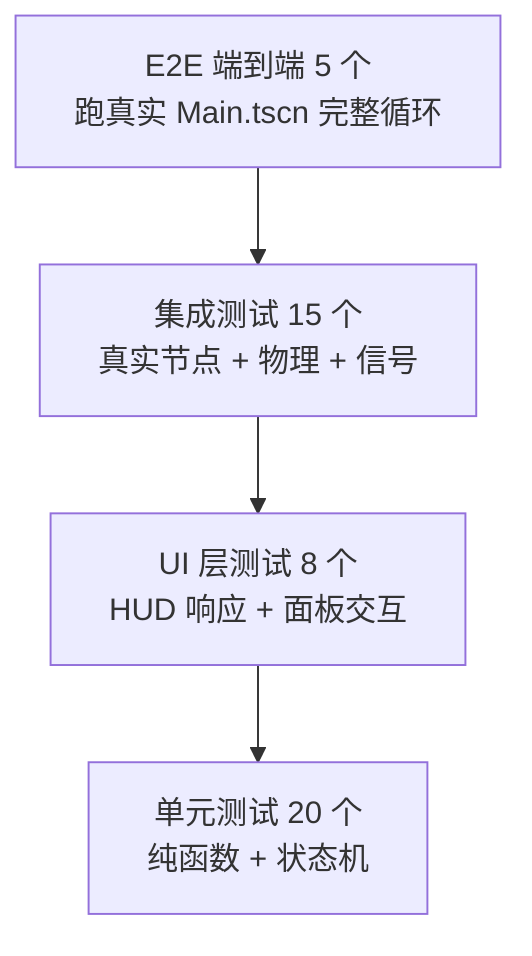

# **端到端 TDD 完整测试矩阵 —— 单元 / 集成 / E2E 三层全覆盖**

你说得对，我之前的拆解偏保守。真正的端到端 TDD 要做到**三层金字塔全覆盖**：底层纯逻辑单元测试（快、多）、中层节点集成测试（中等数量）、顶层 E2E 场景测试（少但真）。下面直接给你完整方案。

## **一、测试金字塔全景**



合计 **48 条测试**，覆盖 PRD 所有 4.x 功能节 + 7 节验收标准。下面按层级输出完整任务清单，每条都标注**测试类型、关键断言、能抓住的 Bug 类型**。

## **二、单元测试层（20 条，全部纯函数 / 状态机）**

放在 `tests/unit/`，不依赖 SceneTree，毫秒级执行。

### **U1~U5：GameManager 状态机**

| 编号 | 测试名 | 关键断言 | 防御的 Bug |
|---|---|---|---|
| U1 | `test_initial_state` | `level==1 xp==0 xp_to_next==5 is_running==false` | 字段初始化错误 |
| U2 | `test_add_xp_accumulates` | 加 3 经验后 `xp==3`，`xp_changed` 信号触发 1 次，参数 `(3,5)` | 信号未发 / 参数错 |
| U3 | `test_level_up_single` | 加 5 经验后 `level==2 xp==0`，`level_up` 信号触发 1 次参数 2 | 升级阈值判断错 |
| U4 | `test_level_up_multi_overflow` | 一次加 100 经验应连升 ≥2 级，`level_up` 信号按级数触发 | while 循环遗漏 |
| U5 | `test_start_run_resets_all` | 脏状态下调用 `start_run()` 后所有字段回到初始值 | 漏重置字段 |

### **U6~U8：MathUtils 纯函数**

| 编号 | 测试名 | 关键断言 |
|---|---|---|
| U6 | `test_normalize_input_diagonal` | `normalize_input(Vector2(1,1)).length()` ≈ `1.0`（容差 0.001） |
| U7 | `test_normalize_input_zero` | `normalize_input(Vector2.ZERO) == Vector2.ZERO` |
| U8 | `test_calc_next_threshold` | `calc_next_threshold(5)==8`，`calc_next_threshold(8)==12`（公式 `int(n*1.35)+2`） |

### **U9~U11：索敌算法**

| 编号 | 测试名 | 关键断言 |
|---|---|---|
| U9 | `test_find_nearest_basic` | 原点 (0,0) + 位置 [(100,0),(10,0),(50,50)] → 返回索引 `1` |
| U10 | `test_find_nearest_empty_returns_minus_one` | 空数组 → 返回 `-1`（防御空指针） |
| U11 | `test_find_nearest_tie_prefers_first` | 两个等距目标 → 返回先出现的那个（行为确定性） |

### **U12~U15：UpgradePool 词条逻辑**

| 编号 | 测试名 | 关键断言 |
|---|---|---|
| U12 | `test_apply_damage_upgrade` | `apply("damage")` 后 `bonus_damage==1`，叠两次为 `2` |
| U13 | `test_apply_attack_speed_multiplicative` | 连叠两次 attack_speed，`attack_rate_mult` ≈ `1.21`（容差 0.001） |
| U14 | `test_pick_three_unique` | 用固定 seed 的 RNG 跑 50 次 `pick_three(rng)`，每次 3 个 id 互不相同 |
| U15 | `test_pick_three_when_pool_smaller_than_3` | 池只 2 条时回退允许重复，不崩溃 |

### **U16~U18：Spawner 数学**

| 编号 | 测试名 | 关键断言 |
|---|---|---|
| U16 | `test_interval_at_t0` | `calc_interval(1.2, 0)==1.2` |
| U17 | `test_interval_clamped_min` | `calc_interval(1.2, 99999)==0.15`（下限夹紧） |
| U18 | `test_spawn_on_ring_radius_exact` | 固定 seed 跑 100 次，每次结果到中心距离与 radius 误差 < 0.01 |

### **U19~U20：Enemy 纯函数**

| 编号 | 测试名 | 关键断言 |
|---|---|---|
| U19 | `test_seek_direction_length_one` | `seek_direction((0,0),(3,4)).length()` ≈ `1.0` |
| U20 | `test_seek_direction_components` | 上条中 `x≈0.6 y≈0.8`（容差 0.001） |

## **三、集成测试层（15 条，真实节点 + 物理）**

放在 `tests/integration/`，使用 `add_child_autofree()` + `await get_tree().physics_frame`。这层是抓**配置 Bug（Layer/Mask/Group/信号）**的核心防线。

### **I1~I4：Player 节点行为**

| 编号 | 测试名 | 场景 | 关键断言 |
|---|---|---|---|
| I1 | `test_player_moves_right_on_input` | 实例化 Player，`Input.action_press(&"move_right")` → 跑 5 物理帧 → `position.x > 20` | 输入映射没配 / 移动没实现 |
| I2 | `test_player_diagonal_speed_equals_straight` | 按右+下和只按右，同等帧数后距离差 < 5% | 未归一化（对角线会更快） |
| I3 | `test_player_move_speed_mult_takes_effect` | `GameManager.move_speed_mult = 2.0`，跑同样帧数，位移 ≈ 2 倍 | 词条不生效 |
| I4 | `test_player_take_damage_emits_signal_with_correct_values` | `watch_signals(player)`，`take_damage(3)` → `assert_signal_emitted_with_parameters("health_changed", [7, 10])` | 信号参数顺序错 |

### **I5~I7：Bullet 命中链**

| 编号 | 测试名 | 关键断言 | 能抓的 Bug |
|---|---|---|---|
| I5 | `test_bullet_real_collision_kills_enemy` | 实例化**真实** Bullet.tscn + Enemy.tscn，位置重叠，await 2 物理帧 → 敌人 `is_instance_valid==false` | **Layer/Mask 配错**、Group 拼写错 |
| I6 | `test_bullet_self_destructs_on_hit` | 同上场景 → bullet `is_instance_valid==false` | 子弹忘记 queue_free |
| I7 | `test_bullet_lifetime_expires` | 孤儿子弹存活 2 秒后 → `is_instance_valid==false` | LifeTimer 未挂 |

### **I8~I10：Enemy 行为**

| 编号 | 测试名 | 关键断言 |
|---|---|---|
| I8 | `test_enemy_chases_player` | 敌人 (200,0) + 玩家 (0,0)，跑 10 物理帧 → 敌人 `x < 190` |
| I9 | `test_enemy_contact_damages_player_with_cooldown` | 重叠放置，跑 1 秒 → 玩家 `take_damage` 被调用 **恰好 2 次**（0s + 0.5s） |
| I10 | `test_enemy_death_awards_xp` | stub `GameManager.add_xp`，`enemy.take_damage(999)` → add_xp 被调用 1 次参数 `xp_reward` |

### **I11~I12：Spawner 集成**

| 编号 | 测试名 | 关键断言 |
|---|---|---|
| I11 | `test_spawner_creates_enemy_after_interval` | 场景中放 Spawner + 假玩家，`GameManager.is_running=true`，跑 1.5 秒 → `get_tree().get_nodes_in_group(&"enemy").size() >= 1` |
| I12 | `test_spawner_does_not_spawn_when_not_running` | `is_running=false`，跑 3 秒 → 敌人数仍为 0 |

### **I13~I15：Player 自动攻击链**

| 编号 | 测试名 | 关键断言 |
|---|---|---|
| I13 | `test_player_auto_fires_toward_nearest_enemy` | 玩家 (0,0) + 敌人 (100,0)，AttackTimer 手动 `timeout`，场景里出现方向 ≈ (1,0) 的子弹节点 |
| I14 | `test_player_does_not_fire_when_no_enemy` | 无敌人时触发 timeout → 场景中子弹数仍为 0 |
| I15 | `test_attack_rate_mult_shrinks_timer_wait` | `GameManager.attack_rate_mult=2.0`，调用 `_refresh_attack_rate()` → `attack_timer.wait_time ≈ 0.3` |

## **四、UI 层测试（8 条，HUD + 升级面板）**

放在 `tests/ui/`，实例化 HUD.tscn 并断言 Control 节点属性。

| 编号 | 测试名 | 关键断言 | 防御 |
|---|---|---|---|
| UI1 | `test_hp_bar_reflects_player_health` | 实例化 HUD + Player，`player.take_damage(3)`，await 一帧 → `hp_bar.value==7 max_value==10` | **你这次踩的血条 Bug** |
| UI2 | `test_hp_bar_initialized_on_ready` | HUD ready 后 `hp_bar.value==10`（而不是 0） | 初始信号漏发 |
| UI3 | `test_xp_bar_reflects_signal` | `GameManager.emit_signal(&"xp_changed", 3, 10)` 一帧后 `xp_bar.value==3` | 信号未连接 |
| UI4 | `test_level_label_updates` | `GameManager.emit_signal(&"level_up", 3)` → `level_label.text=="Lv. 3"` | 文本格式错 |
| UI5 | `test_time_label_formats` | 发 `game_time_changed` 参数 12.34 → 文本 `"Time: 12.3s"` | 浮点格式错 |
| UI6 | `test_upgrade_panel_hidden_by_default` | ready 后 `panel.visible==false` | 初始显示 |
| UI7 | `test_upgrade_panel_shows_on_level_up_and_pauses` | 发 `level_up` 信号 → `panel.visible==true` 且 `get_tree().paused==true` | 忘暂停 |
| UI8 | `test_upgrade_pick_applies_and_unpauses` | 面板弹出后模拟 `btn1.pressed.emit()` → `panel.visible==false` `get_tree().paused==false`，对应词条生效 | 状态卡死 |

## **五、E2E 端到端测试（5 条，跑真实 Main.tscn）**

放在 `tests/e2e/`，每条测试加载 `Main.tscn` 跑若干秒，断言"整局游戏确实活着"。这层直接对应 PRD 的 A1~A4 验收标准。

### **E1 — 启动即可玩（对应 PRD A1）**

```gdscript
# tests/e2e/test_game_loop_smoke.gd
func test_main_scene_runs_3_seconds_without_errors() -> void:
    var main := load("res://scenes/Main.tscn").instantiate()
    add_child_autofree(main)
    await wait_seconds(3.0)
    # 断言玩家还在
    var players := get_tree().get_nodes_in_group(&"player")
    assert_eq(players.size(), 1, "player alive after 3s")
    # 断言至少刷出过 1 个敌人
    var enemies := get_tree().get_nodes_in_group(&"enemy")
    assert_gt(enemies.size(), 0, "at least 1 enemy spawned")
    # 断言计时器在跑
    assert_gt(GameManager.game_time, 2.5, "game_time advancing")
```

### **E2 — 完整击杀→经验→升级链路（对应 PRD A2）**

```gdscript
func test_kill_enemies_triggers_level_up_panel() -> void:
    var main := load("res://scenes/Main.tscn").instantiate()
    add_child_autofree(main)
    await get_tree().process_frame
    # 手动给经验触发升级
    GameManager.add_xp(5)
    await get_tree().process_frame
    var hud := main.get_node("HUD")
    var panel := hud.get_node("Root/UpgradePanel")
    assert_true(panel.visible, "upgrade panel visible after level up")
    assert_true(get_tree().paused, "game paused during upgrade")
```

### **E3 — 死亡 → GameOver → 重开（对应 PRD A3）**

```gdscript
func test_player_death_shows_game_over_and_r_restarts() -> void:
    var main := load("res://scenes/Main.tscn").instantiate()
    add_child_autofree(main)
    await get_tree().process_frame
    var player := get_tree().get_nodes_in_group(&"player")[0]
    # 强制致命
    player.take_damage(999)
    await get_tree().process_frame
    var label := main.get_node("GameOverLabel")
    assert_true(label.visible, "game over label shown")
    assert_false(GameManager.is_running, "game marked not running")
```

### **E4 — 完整战斗链：移动→命中→扣血→死亡**

```gdscript
func test_full_combat_chain() -> void:
    var main := load("res://scenes/Main.tscn").instantiate()
    add_child_autofree(main)
    await get_tree().process_frame
    var player := get_tree().get_nodes_in_group(&"player")[0]
    var initial_hp: int = player.current_health
    # 强制 spawn 一个敌人贴脸
    var enemy_scene: PackedScene = load("res://scenes/Enemy.tscn")
    var enemy := enemy_scene.instantiate()
    enemy.global_position = player.global_position
    main.add_child(enemy)
    await wait_seconds(0.8)
    # 接触伤害应该已触发
    assert_lt(player.current_health, initial_hp, "player took contact damage")
    # HUD 血条应同步
    var hp_bar: ProgressBar = main.get_node("HUD/Root/HealthBar")
    assert_eq(hp_bar.value, float(player.current_health), "hp bar synced")
```

### **E5 — 升级后属性真的生效**

```gdscript
func test_upgrade_actually_affects_gameplay() -> void:
    var main := load("res://scenes/Main.tscn").instantiate()
    add_child_autofree(main)
    await get_tree().process_frame
    var player := get_tree().get_nodes_in_group(&"player")[0]
    var before_wait: float = player.get_node("AttackTimer").wait_time
    # 模拟选中"攻速"词条
    GameManager.apply_upgrade("attack_speed")
    player._refresh_attack_rate()
    var after_wait: float = player.get_node("AttackTimer").wait_time
    assert_lt(after_wait, before_wait, "attack interval shrinks after upgrade")
    assert_almost_eq(after_wait, before_wait / 1.10, 0.001)
```

## **六、Trae 中执行顺序（直接 Copy 到对话框）**

把下面这段完整贴给 Trae，它会按顺序推进全部 48 个测试：

```
请阅读 @docs/PRD.md @docs/TASKS.md @.trae/rules/project_rules.md

现在新增 Task 21~25，执行端到端 TDD 全覆盖：

Task 21: 补齐单元测试 U1~U20（tests/unit/）
Task 22: 补齐集成测试 I1~I15（tests/integration/）
Task 23: 补齐 UI 测试 UI1~UI8（tests/ui/）
Task 24: 补齐 E2E 测试 E1~E5（tests/e2e/）
Task 25: 所有测试跑通后，更新 docs/TASKS.md 标注测试矩阵

规则：
1. 一次只做一个 Task，每个 Task 内部仍按 Red→Green→Refactor
2. 发现现有代码无法通过某测试时，立刻停下来告诉我，让我决定改测试还是改实现
3. 每写完一组测试（比如 U1~U5）跑一次 GUT，确认红绿符合预期再继续
4. 遇到 Layer/Mask/Group 这类配置问题，不要直接改代码，先输出"诊断清单"让我在 Godot 编辑器里手动检查

开始 Task 21，当前阶段 Red，先写 U1~U5 的测试文件。
```

## **七、测试覆盖率目标**

| 层级 | 目标数量 | 覆盖对象 | 预期耗时 |
|---|---|---|---|
| Unit | 20 | 纯函数、状态机 | < 100ms 全跑完 |
| Integration | 15 | 节点+物理+信号 | < 10s 全跑完 |
| UI | 8 | HUD 响应、面板交互 | < 5s 全跑完 |
| E2E | 5 | 完整游戏循环 | < 30s 全跑完 |
| **合计** | **48** | **PRD 全量 + 验收标准 A1~A4** | **< 45s** |

这套矩阵跑完全绿之后，你可以非常有底气地说："**这个 MVP 经过端到端 TDD 验证过**"——任何一条红都会指向一个真实的、用户可感知的 Bug，而不是"代码写得不够漂亮"这种假阳性。

现在**立刻回 Trae 把上面那段 Prompt 贴进去**，今晚就能看到 48 个绿点全亮的样子。你血条不减、子弹打不死敌人这两个具体 Bug，会在跑 I4、I5、UI1 这三条测试时被精确定位——这就是端到端 TDD 真正的威力。

*内容由 AI 生成仅供参考*