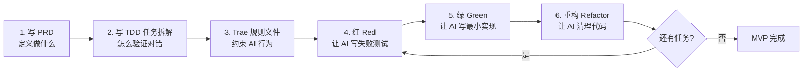

# **从 PRD 到 TDD：Godot 新手在 Trae AI IDE 中的手把手实战指南**

你的思路完全正确——**PRD（产品需求文档）在前，TDD（测试驱动开发）在后**，这是目前 AI 辅助编程最主流、最稳定的工作流。PRD 负责"定义做什么"，TDD 负责"验证做对没有"，两者结合起来，AI 才能在 Trae 这样的智能 IDE 中持续、可控地帮你写出正确代码，而不是每次都偏题跑飞。下面我会把这套流程从零拆给你看，**假设你是 Godot 新手，Trae AI IDE 刚刚装好，项目一片空白**。

## **一、完整工作流总览**

在深入每一步之前，先记住这张"路线图"——后面所有内容都围绕它展开：



这套流程的精髓是：**PRD 是"宪法"，TDD 任务是"法律条文"，Trae 规则文件是"执法手册"，红绿重构是"日常执法"**。四层叠加后，AI 才会稳定输出你想要的结果。

## **二、第一步：写好 PRD 文档**

PRD 不需要写得像大厂那样厚重，MVP 阶段一页纸就够。关键是**把 AI 可能猜错的地方全部说死**，尤其是数值、边界和"不做什么"。

### **2.1 在项目根目录创建 `docs/PRD.md`**

在 Trae 里 `Ctrl+Shift+P` → 新建文件，路径写 `docs/PRD.md`，然后把下面这份模板抄进去，根据你的想法微调即可。这份 PRD 就是**你和 AI 的唯一事实来源**，后续所有提问都要 `@PRD.md` 引用它。

```markdown
# 肉鸽 MVP 游戏 —— PRD v0.1

## 1. 产品定位
- 类型：2D 俯视角自动射击肉鸽（Vampire Survivors lite）
- 平台：Godot 4.6，PC
- 目标：1 周内产出"能跑完整循环"的 MVP，零美术资源（全部 ColorRect 占位）

## 2. 目标用户 & 核心体验
- 用户：自用 / 同好试玩
- 核心体验关键词：上手 3 秒、死亡 3 分钟内、下一局立刻想再来

## 3. 核心玩法循环（必须实现）
移动 → 自动射击最近敌人 → 击杀得经验 → 升级三选一 → 敌人变强 → 死亡 → 重开

## 4. 功能需求（MVP 范围）

### 4.1 玩家
- 操作：WASD / 方向键八向移动，对角线速度必须与直线相等（归一化）
- 属性：血量 10、基础移速 220、基础伤害 1、基础攻击间隔 0.6s
- 受伤后 0.6s 无敌帧，期间不再扣血
- 血量 ≤ 0 即死亡，触发 GameOver

### 4.2 敌人
- 出生：玩家周围 520 半径圆上随机位置
- 行为：始终朝玩家直线移动，速度 95
- 属性：初始血量 3，每 15 秒全局 +1 血
- 接触玩家造成 1 点伤害，0.5s 冷却一次
- 死亡掉落 1 经验

### 4.3 子弹
- 玩家每到攻击间隔自动朝"最近敌人"发射一颗
- 速度 520，存活 1.5s 自毁
- 命中敌人造成 (基础伤害 + 伤害加成) 点伤害后自毁

### 4.4 升级系统
- 经验阈值：初始 5，每升一级 × 1.35 + 2
- 升级时游戏暂停，弹出三选一面板，池内 3 条词条：
  - 伤害 +1（加法）
  - 攻速 +10%（乘法）
  - 移速 +10%（乘法）
- 选中后关闭面板、恢复游戏

### 4.5 UI
- 左上：血条、经验条、等级、存活时间
- 死亡时屏幕中央显示 "YOU DIED (按 R 重开)"

## 5. 非功能需求
- 60 FPS 稳定（100 敌人以内）
- 所有视觉资源零依赖，可直接 F5 运行
- GDScript 静态类型签名，禁止 `var x = ...` 不写类型

## 6. 明确不做（Out of Scope）
- 不做：美术资源、音效、存档、联机、多角色、多武器、房间/地图、Boss、主菜单
- 后续版本再考虑，本期任何时候 AI 提议这些，都直接拒绝

## 7. 验收标准（Acceptance Criteria）
A1. 按 F5 后 3 秒内玩家出现、可移动、敌人开始刷
A2. 连续击杀 5 个敌人触发升级面板，选完游戏恢复
A3. 玩家死亡后屏幕显示 YOU DIED，按 R 重开能从第 1 级开始
A4. GUT 测试全绿，覆盖核心逻辑（GameManager、数学工具、升级池）
```

**关键技巧**：第 6 节「明确不做」非常重要。AI 有个老毛病，就是"顺手帮你多做点"——你要杀鸡，它给你上牛刀。把不做的事白纸黑字写清楚，AI 看到 PRD 就不会乱扩展。

## **三、第二步：写好 TDD 任务拆解文档**

PRD 写完后，不要急着让 AI 写代码，**先把上一轮我给你的那份 20 个任务的拆解文档也落盘**。建议保存为 `docs/TASKS.md`，内容就是前一条回答里"四、任务拆解"那部分，原样复制即可。

这份文档的作用是：**当你在 Trae 对话框里让 AI 做 Task N 时，AI 能直接对照着做，不会自由发挥。**

到这里你的 `docs/` 目录应该是这样：

```
docs/
├── PRD.md       # 做什么
└── TASKS.md     # 怎么一步步做、怎么验证
```

## **四、第三步：配置 Trae 的项目规则（最关键一步）**

Trae AI IDE 支持**项目级 Rules 文件**（和 Cursor 的 `.cursorrules`、Claude Code 的 `CLAUDE.md` 一个意思），写在里面的规则 AI 每次都会读，等于给 AI 戴上紧箍咒。**这一步 90% 的新手会忽略，但它恰恰决定了 AI 是不是"听话"。**

### **4.1 在项目根目录创建 `.trae/rules/project_rules.md`**

内容直接用下面这份模板，它已经把 Vibe Coding 的 7 条规范和 Godot/GUT 的坑全写进去了：

```markdown
# 项目规则（AI 必读，每次对话都要遵守）

## 身份
你是一位精通 Godot 4.6 + GDScript + GUT 测试框架的资深游戏程序员。
用户是 Godot 新手，请用清晰的中文解释每一步为什么这样做。

## 工作流硬性约定
1. 任何代码改动前，必须先阅读 `docs/PRD.md` 和 `docs/TASKS.md`。
2. 一次对话只做一个 Task。做完即停，等我说"下一个"再继续。
3. 严格按 红(Red) → 绿(Green) → 重构(Refactor) 三段式输出：
   - Red 阶段：只写失败的测试文件，不写实现代码。写完让我确认。
   - Green 阶段：写最小实现让测试通过，不做多余优化。
   - Refactor 阶段：只在测试仍绿的前提下清理代码，不改变外部行为。
4. 每个阶段结束，必须明确告诉我：
   - 我应该在 Trae 里执行什么操作（点哪里、按什么键）
   - 预期看到什么结果（测试红/绿、控制台输出）

## 代码规范
- GDScript 全部使用静态类型：`func foo(x: int) -> Vector2:`，禁止隐式类型。
- 节点脚本路径：`res://src/<category>/<Name>.gd`
- 测试文件路径：`res://tests/unit/` 或 `res://tests/integration/`
- 测试文件名：`test_<被测对象>.gd`，测试函数名：`test_<行为描述>()`
- 断言用具体数值，禁用 `assert_true(x != null)` 这类弱断言。
- 使用 `@onready` 获取节点，不要在 `_ready()` 里 `get_node()`。
- 信号优先于直接调用，跨节点通信走 signal 或 Autoload。

## 禁止事项
- 禁止未经我同意引入任何第三方插件（GUT 除外）。
- 禁止新增 PRD 未定义的功能，哪怕看起来"很酷"。
- 禁止一次输出超过 2 个文件的改动。
- 禁止在没有测试的情况下写业务逻辑（UI/视觉代码可豁免）。

## 输出格式
每次回复按这个结构：
1. **当前 Task**：编号和名称
2. **当前阶段**：Red / Green / Refactor
3. **改动文件**：列出路径
4. **代码**：完整文件内容（不要省略号）
5. **我该做什么**：Trae 中的具体操作步骤
6. **预期结果**：应该看到什么
```

保存后，**Trae 会在每次新对话时自动加载这份规则**。如果你用的是较早版本的 Trae，规则文件也可能叫 `.traerules` 或放在设置里，找不到时直接问 Trae 自己："在我的 Trae 里项目规则文件放在哪？"它会告诉你当前版本的正确路径。

## **五、第四步：Trae AI IDE 里的实操流程**

现在前期准备全部完成，进入真正的开发节奏。以 **Task 0（项目初始化 + GUT 安装）** 为例走一遍，后面每个 Task 都是同样的节奏。

### **5.1 打开 Trae 的 AI 对话侧边栏**

Trae 的 AI 对话默认在右侧，快捷键一般是 `Ctrl+L`（或 `Cmd+L`）。**推荐把对话模式切到 Agent / Builder 模式**，这样 AI 可以直接帮你创建文件、跑命令，不需要你手动复制粘贴。

### **5.2 第一条 Prompt：让 AI 读懂背景**

在对话框输入：

```
请先阅读 @docs/PRD.md 和 @docs/TASKS.md 和 @.trae/rules/project_rules.md，
读完后用三句话总结：你理解的项目目标、当前工作流、第一个要做的 Task 是什么。
不要写任何代码。
```

**`@` 符号是 Trae 的文件引用语法**，输入 `@` 会弹出文件选择器。这一步是让 AI 把上下文全部吃进脑子，避免它后面"失忆"。确认 AI 总结无误后再继续。

### **5.3 第二条 Prompt：启动 Task 0 的 Red 阶段**

```
开始 Task 0，当前阶段 Red。
请按项目规则的输出格式执行。
```

因为规则文件里写了"一次只做一个 Task + 三段式 + 固定输出格式"，AI 会只写失败的测试，并告诉你去哪里装 GUT。**按它说的做，不要自由发挥**。

### **5.4 在 Trae 里安装 GUT 的正确姿势**

GUT 的安装方式有两种，新手推荐第二种：

1. **AssetLib 方式**：Godot 编辑器顶部 → AssetLib 标签 → 搜 "Gut" → 下载安装 → Project → Project Settings → Plugins → 启用 Gut。
2. **手动方式（更可控）**：去 [GUT GitHub Releases](https://github.com/bitwes/Gut/releases) 下个最新 zip，解压后把 `addons/gut` 整个拷进你的项目 `addons/` 目录，回到 Godot 启用插件。

**装完后必做的一步**：在 Godot 里点顶部菜单 `Project → Project Settings → Plugins`，确认 Gut 那行 Status 是 `Enabled`。然后顶部菜单会多出一个 `Gut` 入口，点它就能看到测试面板。

### **5.5 跑第一条测试**

回到 Trae，让 AI 进入 Green 阶段：

```
Red 阶段测试已就绪。请进入 Green 阶段。
```

它会让你在 Godot 的 Gut 面板里点 "Run All"。如果看到绿色的 1 passed，恭喜你，TDD 第一轮跑通了。**这一刻你要做的事**：在 Trae 终端里跑：

```
git init
git add .
git commit -m "chore: bootstrap project with gut"
```

每个 Task 做完都 commit 一次，这是 Vibe Coding 可回滚的命脉。

## **六、后续 Task 的标准节奏（背下来）**

从 Task 1 开始，每一个 Task 都严格按这四句 Prompt 推进，你只需要改编号：

```
第一句：开始 Task N，当前阶段 Red。
[AI 写测试 → 你在 Godot 里跑 GUT 确认测试红]

第二句：测试已红。进入 Green 阶段。
[AI 写最小实现 → 你跑 GUT 确认变绿]

第三句：测试已绿。进入 Refactor 阶段。如无需重构请明说。
[AI 清理代码或明确说"本次无需重构" → 你再跑一次 GUT 确认仍绿]

第四句：Task N 完成。请生成本次 commit message，我去提交。
[AI 给出规范的 commit message，你 git commit]
```

**这四句话是 Vibe Coding 的"真言"**，掌握它比学任何 Godot 技巧都重要。你会发现自己根本不需要记忆 GDScript 语法——AI 写、你审、测试验，一个循环下来 10 分钟，20 个 Task 就是 3~4 小时的事。

## **七、新手必踩的 5 个坑与对策**

第一个坑是**一次让 AI 做太多**。新手常见错误是："帮我把玩家、敌人、子弹都写好"，结果 AI 给你一坨能跑但全是 bug 的代码，你根本不知道哪里错。对策：强制一次一个 Task，规则文件已经写死了。

第二个坑是**不写规则文件直接聊天**。没有规则约束的 AI 会把 `var x = 1` 和 `var x: int = 1` 混着写，一会儿用 signal 一会儿直接 `get_node()` 穿透，代码风格崩坏。对策：`.trae/rules/project_rules.md` 是第一优先级。

第三个坑是**测试写得太弱**。比如 `assert_true(player != null)` 这种测试永远是绿的，骗自己而已。对策：断言必须带具体数值或状态，规则文件第二节已强调。

第四个坑是**绕过 GUT 面板手动验证**。新手喜欢 F5 跑游戏肉眼看"好像对了"，但人眼判断不了"对角线速度归一化是否精确"。对策：只要是 TASKS.md 里定义的测试，就必须在 GUT 面板里跑过绿。

第五个坑是**PRD 定了又改，改了又定**。中途频繁改 PRD 会让 AI 和你都混乱。对策：MVP 阶段 PRD 冻结，所有新想法写到 `docs/BACKLOG.md` 里，MVP 完工后再说。

## **八、你现在立刻要做的 3 件事**

第一件事是**把 `docs/PRD.md` 照着我给的模板抄进项目**，花 15 分钟按你自己的想法调整数值（比如想要更快的攻速、更多血量），但保持"明确不做"那一节至少 5 条。

第二件事是**把 `docs/TASKS.md` 也落盘**，内容用上一条回答里的 20 个任务拆解，不用改。

第三件事是**创建 `.trae/rules/project_rules.md`**，直接复制我上面那份模板，保存后在 Trae 开一个新对话，第一句话就打 "请阅读 `@docs/PRD.md`" 那段话，确认 AI 能正确总结项目，然后喊它做 Task 0。

走通 Task 0 之后，你就会对整个节奏有肌肉记忆——后面 19 个 Task 就是重复这个节奏。**真正的学习不是看完这份回答，而是今晚花 30 分钟把 Task 0 跑通**。跑通的那一刻，你会突然明白："原来 AI 辅助开发不是让 AI 替我写代码，而是让 AI 在我制定的规则和测试下写代码"——这就是 PRD + TDD + Vibe Coding 三位一体的真正威力。

*内容由 AI 生成仅供参考*